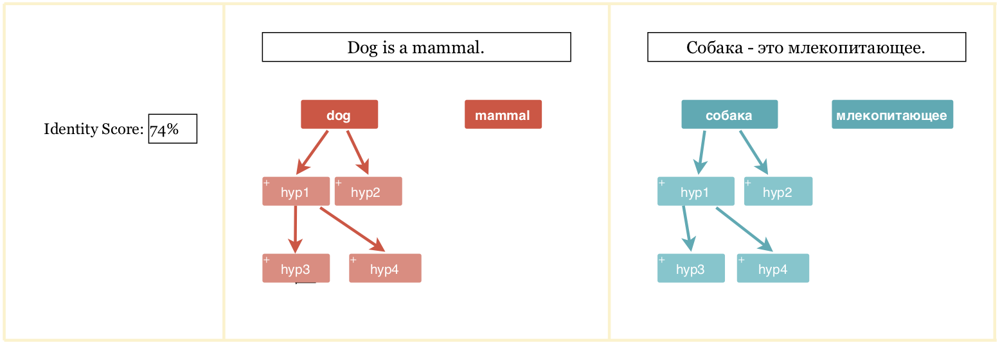
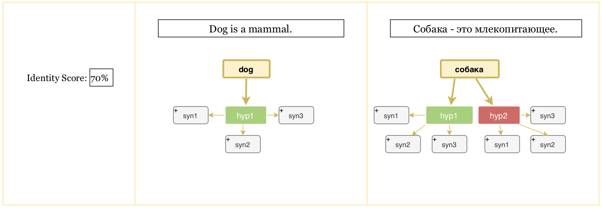

Aknur Shailyatova
Sultan Apsalyamov
Batyrkhan Zhumabekov

We decided to compare Russian and English words by their translation. There will be graphs. Each word in both languages will be compared layer by layer.

  + The space is divided by three parts.
  + There are two fields. The original sentence in English is written on the second part of the space. On the third part there is its translation in Russian.
  + Each word is a node of graph and links go downward.
  + There is a “+” (plus) sign near each word. When we click on it on the first part of the space information about the score of similarity of the Russian and English words appear.
    - If translation of words match each other, the rectangles become green, otherwise, red.
    - Around hyperonyms synsets appear. The matching between sysnets is compared in the same way.

Step 1 - Hyperonyms view

Step 2 - Synonyms view

